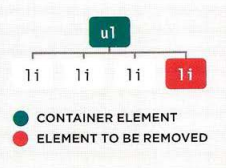

# Read: 06 - JS Object Literals; The DOM
- The problem domain
- Ch3: Object Literals pp100-105
- Ch5: DOM 183-242

## Understanding the Problem Domain
- It's hard to learn more than 1 thing at once. 
- The guy uses the same problem when he is learning a new technology
    - I have been thinking of a timer app
    - or a dice rolling app

### Why are Domains Hard?
- It's hard to put together a puzzle if you don't know what it looks like.
- We need to find a way to see the big picture so we can put the pieces together

### Programming is Easy(ish) if you Understand the Problem Domain
- It's easy to build in an old waterfall approach
    - Tougher in agile

### What to do about it
- Make the problem domain easier
- Get better at understanding the PD.
- If it's to difficult to understand break it apart

## JS Object Literals
### What is an Object
- Objects group variable and functions to create a model of something.
    - Variables are called properties
    - Functions are called methods
- Object names are called **keys**

### Literal Notation for Object creation Example

```JavaScript
var hotel = {
    name: 'Airbnb',
    rooms: 4,
    booked: 2,
    gym: true,
    roomTypes: ['twin', 'double', 'master'],
    checkAvailability: function(){
        return this.room - this.booked;
    }
}
```

### Accessing an object and using Dot Notation
- `[objectName].[propertyName];`
- `[objectName].[methodName()];`

```JavaScript
var hotelName = hotel.name;
var roomsFree = hotel.checkAvailability();
```

- you can access properties (not methods) using brackets
    - `var hotelName = hotel['name'];`

---

## The DOM 183-242
- The Document Object Model specifies how browsers should create a model of an HTML page and how JS can access and update the contents of a page.
- Each object represents a different part of a page.
- DOM is an API (application programming interface.)

### The DOM Tree
- a model of a web page.
- Document Node: Represents the entire page.
- Element Node: Describe the structure of and HTML page
    - Once you find the element you want then you can access its text and/or attribute nodes.
- Attribute Node: Gives access to the attribute of an element
- Text Node: Give access to the text of an element

<sub>[wikipedia](https://en.wikipedia.org/wiki/Document_Object_Model)</sub>

### Working with the DOM Tree
1. Locate the node that represents the element
1. use its text content, child elements, and attributes.

- Access the Elements
    - Select an individual node
        - `getElementById()` HTML
        - `querySelector()` CSS
    - Select multiple nodes
        - `getElementByClassName()`
        - `getElementByTagName()`
        - `querySelectorAll()`
    - Traversing between Element nodes
        - `parentNode`
        - `previousSibling/nextSibling`
        - `firstChild/lastChild`

- Work with those Elements
    - Access/Update Text
        - `nodeValue`
    - Work with HTML content
        - `innerHTML`
        - `textContent`
        - Can create new nodes, add nodes to a tree and remove nodes from a tree
            - `createElement()`
            - `createTextNode()`
            - `appendChild()/removeChild()`
    - Access or update attribute values
        - `hasAttribute()`
        - `getAttribute()`
        - `setAttribute()`
        - `removeAttribute()`

### Caching DOM Queries
- Methods that find DOM elements are called queries.
- Sometimes you need to query the same element multiple times.
    - use a var to store the result of the query.
    - Some people will call this 'storing an element in a variable'

### Accessing Elements
- DOM queries may return only 1 element or they may return a NodeList (collection of nodes).
    - If a method can return more than one node it will return a NodeList (in the form of an array). You will then need to select the node you are looking for using an index.
    - Finding the quickest way to access an element in your page will make the page seem faster/responsive.

### Element Selecting Methods:
- Single Node Returns
    - `getElementById('[id]')` - Selects the element that has specified [id]
    - `querySelector('[css selector]')` - Uses CSS selector syntax that would select 1 or more elements. This method returns only the 1st of the matching elements.
- 1 or more element returns - produces a collection
    - `getElementByClass('[class]')` - Select the elements of that class - produces a collection
    - `getElementsByTagName('[tagName]')` - Selects all the elements of the page with that tag - produces a collection
    - `querySelectorAll('[css selector]')` - Uses CSS selector syntax to select one or more elements and returns all of those that match. - produces a collection
- NodeList is a collection of element nodes. THey look like arrays but they are collections. 
- Live NodeList- when your script updates the page. Typically faster to generate than static NodeLists.
- Static NodeList- when you script updates the page, the NL is not updated to reflect the changes made by the script.

### Selecting an item from a NodeList
- `item()` method - 
- `array[0]` syntax - faster

### Selecting Elements using CSS Selectors
- not as fast as the others

### Can use a loop to repeat actions for the entire NodeList
```JavaScript
var hotItems = document.querySelectorAll('li.hot');
for(var i = 0; i<hotItems.length; i++){
    hotItems[i].className = 'cool';
}
```

### Looping Through the DOM
### Traversing the DOM
- WHen you a have an element node, you can select another element in relation to it:
    - `parentNode`
    - `previousSibling`
    - `nextSibling`
    - `firstChild`
    - `lastChild`
- Whitespace Nodes 
    - Most browsers treat WS between elements as a text node.
    - can make using theses transversal properties not work. 
    - you can strip all the whitespaces out but that would make your code harder to read.
    - jQuery has ways of dealing with this

### Get/Update Element Content
<sub>Duckett pg. 212</sub>
<sub>Duckett pg. 213</sub>
- If there is text in an element then a new 'text' node is created.
    - `nodeValue` - Accesses text fom the node
- When you're in the containing element use:
    - `innerHTML` - gets/sets text & markup
    - `textContent` - gets/sets text only
    - `innerText` - gets/sets text only (*should be avoided*)

> <sub>Duckett pg 214</sub>
> `document.getElementById('one').firstChild.nextSibling.nodeValue;` <br/>

### Accessing & Changing  a text node
```JavaScript
var itemTwo = document.getElementById('two'); // Get second list item
var elementText = itemTwo.firstChild.nodeValue; //Get its text content
elementText = elementText.replace('thingToBeReplaced', 'thingThatWillReplace'); // change defined thing to the other.
itemTwo.firstChild.nodeValue = elText; //Update the list item
```

- <s>`innerText`</s> Should be avoided
    - Some browsers don't support it since it's not part of any standard
    - It will not show content hidden by CSS
    - it is slower

### Adding or Removing HTML Content
- `innerHTML` - Note: There are security risks associated with using innerHTML.
- Adding Content
    - Store new content in a string variable
    - Select the element whose content you want to replace
    - Set the element's innerHTML to the new String.
- Removing Content
    - To remove all content from an element you set `innerHTML` to an emptry string.
    - To remove 1 element from a DOM fragment you need to provide the entire fragment minus that element
- Adding with 'DOM manipulation' - easily targets individual node in the DOM tree
    - Need to create all the element and then attach them to the tree.
    - `createElement()` - creates and element that can be added to the tree
    - `createTextNode()`- creates a new text node to attach to an element
    - `appendChild()` - attaches a  node to an element 

```JavaScript
var newElement = document.createElement('li');
var newText = document.createTextNode('quinoa');
newElement.appendChild(newText);
var position = document.getElementByTagName('ul')[0];
position.appendChild(newElement);
```

- Removing with 'DOM manipulation'
    - Store the element to be removed in a var
    - Store the parent of that element in a var
    - remove the element from its containing element
```JavaScript
var removeElement = document.getElementByTagName('li')[3];
var containerElement = removeElement.parentNode;
containerElement.removeChild(removeElement);
```
<sub>Duckett pg225</sub>

### `innerHTML` vs DOM Manipulation
- `innerHTML`
    - Advantages:
        - Can add a large amount of markup using less code
        - It's faster than DOM manipulation
        - It's a simple way of removing all content
    - Disadvantages:
        - It should not be used to add content from the user. 
        - Can be difficult to isolate single elements
        - Event handlers may no longer work as intended
- 'DOM Manipulation`
    - Advantages: 
        - It is suited to change 1 element from a DOM fragment where there are many siblings.
        - It doesn't affect event handlers
        - It easily allows a script to add element incrementally.
    - Disadvantages:
        - It's slower than `innerHTML` for large jobs
        - You need to write more code to achieve the same result.

### Cross-site Scripting (XSS) attacks
- using `innerHTML` opens up site to XSS.
- data that you don't have complete control over is called **untrusted data**
- XSS can give attackers access to:
    - The DOM
    - the sites cookies
    - session tokens
- The attacker might even get access to your users accounts

### Defending against XSS
- Validate input going to the server
    - Only let visitors input the kind of characters they need to when supplying info.
    - Double-check validation on the server before displaying user content/storing it in a db. 
- Do not place user's content in
    - script tags
    - HTML comments
    - Tag Names
    - Attributes
    - CSS values
- All untrusted data needs to be escaped
    - make sure any of these char are escaped
        - `&` - `&amp;`
        - `<` - `&lt;`
        - `>` - `&gt;`
        - ` - [&#x60];
        - `'` - `&#x27;` (not `&apos;`)
        - `"` - `&auot;`
        - `/` - `&#x2f;`
    - JavaScript
        - never include data from untrusted sources in JS. Escape all ASCII characters with a value less than 256 that are not alphanumeric. 
    - ULS
        - use `encodeURComponent()`
    - Adding User Content
        - JavaScript
            - Use: `textContent` or `innerText`
            - Don't Use: `innerHTML`
        - JQuery
            - Use: `.text()`
            - Don't Use: `.html()`
- you can still used `innerHTML` and `.html()` you just have to ensure you control all the markup being generated.

### Attribute Nodes
- Once you have access to a node you can access and change its attributes.
    - `getAttribute()` - gets the value of an attribute
    - `hasAttribute()` - checks if element node has a specified attribute
    - `setAttribute()` - sets the value of an attribute
    - `removeAttribute()` - removes an attribute from an element node
    - `className` - gets/sets the value of the class attribute
    - `id` - gets/sets the value of the **id** attribute

### Check for an attribute and get its value
- before trying to set an attribute you need to make sure if the node has that attribute.
    - check to see if the attribute is there
        - if there change its value
        - if not assign the property and then assign the new attribute

### Examining the DOM in Chrome
- `f12` on PC
