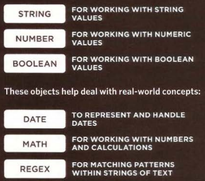
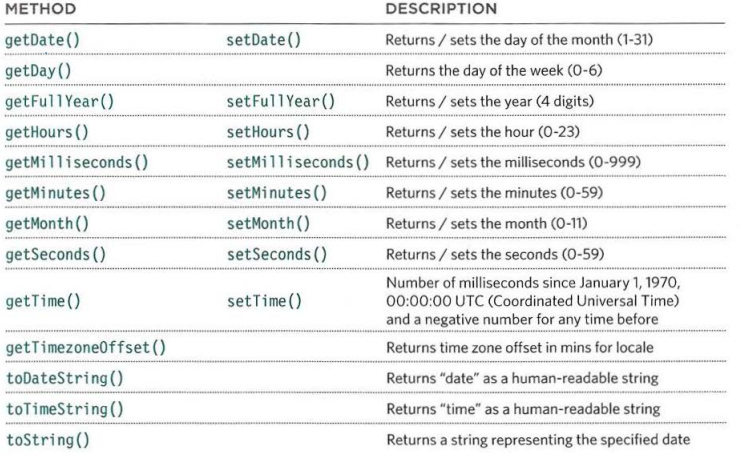

# Read: 07 - HTML Tables; JS Constructor Functions
#### 5/2/20
- Domain Modeling
- Tables pp 126-145
- Functions, Methods and Objects 106-144

## Domain Modeling
- Domain Modeling is the process of creating a conceptual model in code for a specific problem.
- Constructors are defined using function expressions.
    - There are no classes in JavaScript. Everything is already and object. 
```JavaScript 
var EpicFailVideo = function(epicRating, hasAnimals) {
  this.epicRating = epicRating;
  this.hasAnimals = hasAnimals;
}
```
- `new` keyword instantiates and object
- The constructor function initializes properties inside that object using th `this variable
- the object is stored in a variable for later use. 

- `prototype` - Allows you to add properties to constructors. 
When `parkourFail` is asked to run the `generateRandom()` method, it searches through all of its own methods. When it doesn't find the `generateRandom()` method there, `parkourFail` then searches through all of the methods on its prototype object. When it finds the `generateRandom()` method on its prototype object, parkourFail calls the method, passing in 1 and 5 as the arguments. The `generateRandom(1, 5)` method runs and returns a random number between 1 and 5. 

```JavaScript
'use strict';

var X = function(){
  this.num = 4;
};


var y = new X();

console.log(y.num);

// Define the constructor
var EpicFailVideo = function(epicRating, hasAnimals) {
  this.epicRating = epicRating;
  this.hasAnimals = hasAnimals;
};

// Instantiates 2 new objects using the constructor
var parkourFail = new EpicFailVideo(7, false);
var corgiFail = new EpicFailVideo(4, true);

// Use prototype to add a new method to the constructor
EpicFailVideo.prototype.generateRandom = function(min,max){
  return Math.floor(Math.random() * (max - min + 1)) + min;
};


console.log(parkourFail);
console.log(corgiFail);


EpicFailVideo.prototype.dailyLikes = function(){
  var viewers, percentage;

  viewers = this.generateRandom(10,30) * this.epicRating;

  if(this.hasAnimals){
    percentage = 0.75;
  } else {
    percentage = 0.40;
  }

  return Math.round(viewers * percentage);
};


console.log(parkourFail.generateRandom(1,5));
console.log(corgiFail.generateRandom(1,5));

console.log(parkourFail.dailyLikes());
console.log(corgiFail.dailyLikes());
```

## Tables pp 126-145
- `<table>` - table tag
- `<tr>` - table row
- `<td>` - table data
- `<th>` - table heading
- `<td colspan="2">` - column span
- `<td rowspan="2">` - row span

### Long Tables
- `<thead>` - The heading of the table should live here
- `<tbody>` - The main body elements should live inside here
- `<tfoot>` - Foot elements lives here

### Width & Spacing (Old)
- `<table width="400" cellpadding="10 cellspacing="5">`
    - Width - 
        - In the `<table>` tag it tells how wide the whole table should be. 
        - In the `<th>` or `<td>` tells how wide that cell should be
    - Padding - How much space there should be between the data and the edge of the cell
    - cellspacing - How much space there should be between each cell

### Border & Background (Old)
- `<table border="2" bgcolor="#efefef">` -
    - The color and the thickness of the border around the whole table and between each cell.

## Functions, Methods and Objects 106-144

### Creating an Object: Constructor Notation
```JavaScript
var hotel = new Object();
hotel.name = 'Quay';
hotel.rooms = 40;
hotel.booked = 25;
hotel.checkAvailability = function(){
    return this.room - this.booked;
}
```

### Updating an Object
- `hotel.name = 'Park';`
- `hotel['name'] = 'Park';`

### Adding Properties to an object
- `hotel.pool = true`

### `this` 
Where the function is declared alters what `this` means.
    - It always refers to one object, usually the object in which the function operates.

- global scope - `this` is a reference to the object that the function is created inside.
- Global variable - All global vars also become properties of the inner object.
- Method of an object - When a method is being defined `this refers to the containing object.
- Function expression as method - `this.[property]`

### Storing Data
- Arrays are objects
- Arrays store objects
    - So an array is on object holding objects

### Built in Objects
1. Browser Object Model
    - BOM contains objects that represent the current browser window or tab. 
    - <sub>Duckett pg.122</sub>
1. DOM
    - DOM creates objects to create a representation of the current page.
1. Global JS Objects
    - JSO represent things that the JS language needs to create a model.
    - <sub>Duckett pg.123</sub>

### Global Objects: Number objects
- `isNaN()`
- `toFixed()` - Rounds to specific number in decimal places (returns a string)
- `toPrecision()` - Rounds to total number of places (returns a string)
- `toExponential()` - Retruns a string represening the number in exponential notation.

### Global Math Object
- `Math.Pi` - returns pi
- `Math.round()` - rounds to nearest integer
- `Math.sqrt(n)` - Returns square root of positive number
- `Math.ceil()` - round up 
- `Math.floor()` - rounds down
- `Math.Random()` - generates a number between 0(inclusive) and 1(not inclusive)

### Date Object
- to use the Date object you have to instanciate it.
<sub>Duckett pg. 137</sub>


