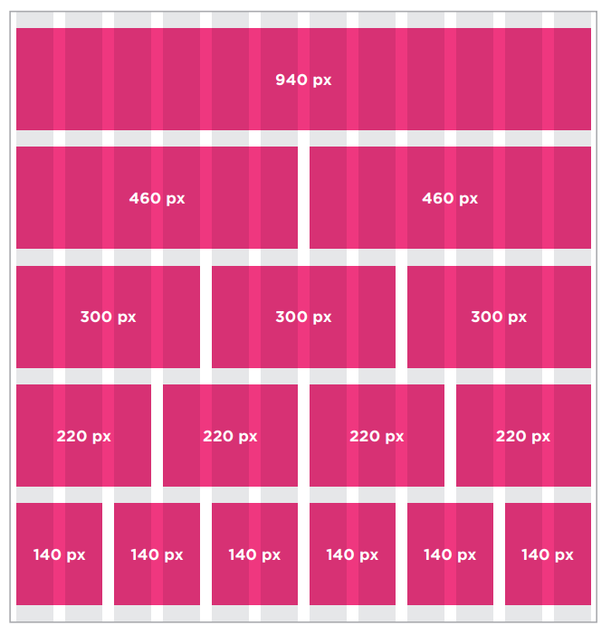
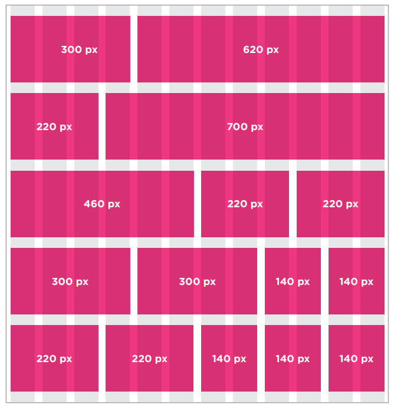

# Read: 08 - More CSS Layout
#### 5/4/20

# This is a Review of Class-04
- Normal Flow - Block-level elements appears on a new line
- Relative positioning - shifting the element to the top, right, bottom , or left of where it would have been placed. 
- Absolute Positioning - Element is taken out of the normal flow

### Flow properties
- `position: static`
  - Each block-level element sits on top of the next.
  - this is the default so it's not necessary to use this property.
- `position: relative`
  - Moves an element in relation to where it would have been in normal flow.
- `position: absolute`
  - This takes the element out of its normal flow and no longer affects the position of other elements on the page. (Acts like it's not there.)
- `position: fixed`
  - A type of absolute positioning that requires the position property to have a value of fixed. 
  - It keeps its position relative to the browser window.
- `z - index`
  - tells the browser what is in front of what.
- Can use float to place element side-by-side
- Use `clear` to get rid of the float

### Parents of floated elements Issue
- If a containing element only contains floated element, some browsers will treated it as if its 0 pixels tall.
    - Traditionally: you would ad an extra element after the last floated box.
    - Modern: `overflow: auto`, `width: 100%;`
### Multi Column
```CSS
.column1 {
  float: left;
  width: 620px;
  margin: 10px;
}
.column2 {
  float: left;
  width: 300px;
  margin: 10px;
  }
```

```CSS
.column1, .column2, .column3 {
  width: 300px;
  float: left;
  margin: 10px;}
```
### Fixed Width vs Liquid Layouts
- Fixed: use pixels
  - Design does not change with the user changes browser window size. (fixed pixel numbers)
  - Advantages 
    - Pixel values are accurate
    - Designer has greater control over the appearance
    - Can control the lengths of lines of text
    - size of an image will always remain the same
  - Disadvantages
    - Can end up with big gaps around the edge
    - If the screen is a much here resolution the page can look smaller and text can be harder to read
    - If a user increases font sizes, text might not fit into the allotted spaces
    - Can take up more vertical space.
- Liquid: use percentages
    - Stretch and contract as the user changes browser window size (use of percentages)
  - Advantages
    - Page expand to fill the browser window
    - a user with a small window wont have to scroll to the side to see all the content
    - its tolerant of users change of font size
  - Disadvantages
    - page can look different from what you expected
    - if the window is wide the text can stretch
    - If narrow words can be squashed
    - images can overflow

### Layout Grid
<sub>Duckett pg 389</sub>
<sub>Duckett pg 390</sub>

### CSS Frameworks
- 960.gs
- Bootstrap

### Importing Stylesheets
- possible reasons to use multiple
  - 1 sheet to control fonts and colors
  - 1 sheet to control layouts
- Can use 1 `<link>` tag in HTML and in the main CSS use `@import url("");`
- or you can use multiple `<link>` in the HTML