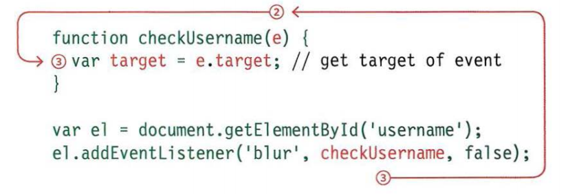
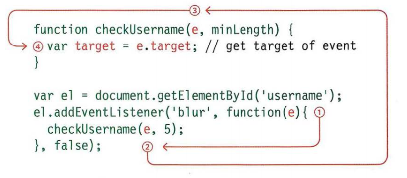

# Read: 09 - Forms and Events
#### 5/3/20

- forms pg 144-175
- lists pg 330-357
- events pg 243-292

## Forms 144-175
- Ways for users to communicate with your website

### Form Controls
- Adding Text
    - Text input (single-line)
    - Password input
    - Text area (multi-line)
- Making Choices:
    - Radio buttons
    - Checkboxes
    - Drop-down boxes
- Submitting forms:
    - Submit buttons
    - Image buttons
- Uploading Files:
    - File upload
### Form Structure
> `<form action="[URL]" method="get">`
- `<form>` - Form controls live inside this element.
- `action` - (Required) Its value is the URL for the page on the server that will receive the info.
- `method` - Forms can be sent using either 'get' or 'post'
    - `get` - the values from the form are added to the end of the URL. Are good for:
        - short forms
        - when you are just retrieving data from the web server (not sending info that should be added to or deleted from a database)
    - `post` - values are sent in HTTP headers. good for:
        - allows users to upload a file
        - is very long
        - contains sensitive data (passwords)
        - adds info to or deletes info from a database.
- `id` - this is the element ID
### Text input
> `<input type="text" name="username" size="15" maxlength="30>`
- `<input>` - tells the browser that this is an input
- `type="text"` - creates a single-line text input.
- `name` - How to label and control the info
- `size` - (Old) How many characters can be displayed
- `maxlength` - Used to define how many chars can be placed in the text box
### Password input
> `<input type="password" name="password" size="15" maxlength="30">`
- `<input>` - tells the browser that this is an input
- `type="password"` - creates a single-line input but the data entered are starred out.
- `name` - same as above
- `size`, `maxlength` - same as above
### Text area
> `<textarea name="comments" cols="20" rows="4"/>` 
- `<textarea>` creates a multi-line input form
- `cols`, `rows` - (Old) Indicatees how many colomns/rows should take up.
### Radio Buttons
> `<input type="radio" name="genre" value="rock">`
- `<input>` - tells the browser that this is an input
- `type="radio"` - creates a radio button on the page
- `name` - same as above
-  `value` - indicate4s the value that is sent to the server for the selected button.
- `checked` - this one will be checked when the page loads.
### Checkbox
> `<input type="checkbox" name="service" value="itunes" checked="checked" />`
- `<input>` - tells the browser that this is an input
- `type="checkbox"` - creates a checkbox on the page
- `name` - same
- `value` - same
- `checked` - this checkbox will be checked when the page loads.
### Drop Down List
```HTML
<select name="devices">
  <option value="ipod">ipod</option>
```
- `<select>` - creates a selection box (drop-down box)
- `name` - same
- `<option>` - specifies the options that the user can select from
- `value` - same
- `selected` - this one will be selected when the page loads
### Multipul Select Box
```HTML
<select name="instruments" size="3" multiple="multiple">
  <option value="guitar" selected="selected">Guitar</option>
```
- `<select>` - same as above
- `<multiple>` - tells the browser that this box is a multi-select box
### File Input Boc
> `<input type="file" name="user-song" />`
- `<input>` - Creates an input box
- `type="file"` - This creates a box that looks like a text input box followed by a browse button.
### Submit Button
> `<input type="submit" name="subscribe" value="Subscribe" />`
- `<input>` - same
- `type="submit"` - Tells the browser to make a submit button
- `name` - what is used by the server
- `value` - is what is displayed
### Image Button
> `<input type="image" src="images/subscribe.jpg" width="100" height="20" />`
- Combines the submit button with an image into 1 tag. 
### Button & Hidden Controls
> `<button>`
- Allows you to combine text and images in between button tags to give them button functionality.
- `<input type="hidden">` - Allows the web page to add values to forms that users cannot see.
### Labelling Form Controls
- `<label>` - Allows for accessibility for vision-impaired users.
> `<label for="female">Female</label>`
- `for` - tells the browser what the button is for.
### Grouping Form Elements
- You can group related form controls together inside the `<fieldset>` element.
    - `<legend>` - The label of the grouped elements
### HTML5 Inputs
- Form Validation - Gives a message to the user if the form isn't filled in correctly
- `required="required"`
- Date Input
    > `<input type="date">` 
- Email & URL
    - `type="email"`, `type="URL"`
- Search Input
    - `type="search"`
    - `placeholder`

## CSS Lists pg 330-357
### Bullet Point Styles
```CSS
ol{
  list-style-type: disc;
}
```
- `list-style-type` - Allows you to control the shape and stile of a list marker.
- `<ul>` 
    - none, disc, circle, square
- `<ol>`
    - decimal, decimal-leading-zero, lower-alpha, upper-alpha, lower-roman, upper-roman
- `list-style-image` - to use an image for a bullet point
```CSS
ul{
  list-style-image: url("[imgURL]");
}
```
- `list-style-position` - `inside` or `outside` will position the bullets/numbers inside or outside of the containing box. 
 -`list-style` - shorthand for the upper styles

### Table Properties
- `width` - sets the width of the table
- `padding` - sets the padding between the text/info and the border
- `text-transform` - converts the content of the table headers to uppercase
- `letter-spacing`, `font-size` - sets the space between the letters. Sets the text font size
- `border-top`, `border-bottom` - set borders above and below the table headers
- `text-align` align the text to the left of some table cells and to the right of the others
- `background-color`
- `:hover` highlight a table row when a user mouses over it.
#### Empty cells
`empty-cells` - allows for attributes to be assigned to empty cells
- `show` shows the borders of any empty cells
- `hide` hides the border
- `inherit` if you have one table nested inside another, the inherit value instructs the table cells to obey the rules of the containing table. 
#### Gaps between cells
- `border-spacing` - distance between cells
- `border-collapse` 
    - `collapse` - borders collapse into a single border when possible
    - `separate` - borders detached from each other
### Styling forms
- Common styling
    - text input and text areas
    - submit buttons
    - labels on forms to get the form controls to align nicely
### Styling Text inputs
- `border-radius` round the corners.
### Styling Submit buttons
- `text-shadow` can give a 3D look to the text.
- `bottom-border` gives a 3D effect
- `:hover` make the button responsive to the user
### Styling Fieldsets & Legends
- Field sets can help group items together in a long form.
### Aligning Form Controls pg 345-346
### Cursor Styles
```CSS
a{
  cursor: move;
}
```
- `auto`
- `crosshair`
- `default`
- `pointer`
- `move`
- `text`
- `wait`
- `help`
- `url("[gifURL]")`

## Events pg 243-292
- Terminology:
    - Fired or Raised - when an event has occurred
    - Events are said to trigger a function or a script
        
Typical Even Listeners:
- UI Events
    - `load` - Web page has finished loading
    - `unload` - web page is unloading (usually because a new page was requested)
    - `error` - Browser encounters a JS error or an asset doesn't exist
    - `resize` - browser window has been resized
    - `scroll` - User has scrolled up or down
- Keyboard Events
    - `keydown` - Key has been pressed
    - `keyup` - key has been released
    - `keypress` - char is being inserted
- Mouse Events
    - `click` - User presses and releases a button over the same element
    - `dblclick` - User double clicks and element
    - `mousedown` - User presses a mouse button over an element
    - `mouseup` - user released mouse button over element
    - `mousemove` - User moves the mouse (not touch screen)
    - `mouseover` - user moves the mouse over an element (not touch screen)
    - `mouseout` - User moves the mouse off an element (not touch screen)
- Focus Events
    - `focus`/`focusin` - - Element gains focus
    - `blur`/`focusout` - Element looses focus
- Form Events
    - `inputs` - value in any `<input>` or `<textarea>` element has changed or any element with the content editable attribute.
    - `change` - value in a select box, checkbox, or radio button changes
    - `submit` - user submits a form (using a button or key)
    - `reset` - user clicks on a form's reset button (rarely used)
    - `cut` - user cuts content from a form field
    - `copy` - user copies content from a form field
    - `paste` - user pastes content into a form field
    - `select` - user selects some text in a form field
- Mutation Events - Occur when the DOM structure has been changed 
    - `DOMSubtreeModified` - Change has been made to the document
    - `DOMNodeInserted` - Node has been inserted as a direct child of another node
    - `DOMNodeRemoved` - Node has been removed from another node
    - `DOMNodeInsertedIntoDocument` - Node has been inserted as a descendant of another node
    - `DOMNodeRemovedFromDocument` - Node has been removed as a descendant of another node

### How to Use an even
1. Select the element node
1. Indicate which event will trigger the response
1. State what you want to have happen during the event

### Ways to bind and event to an element
1. HTML Event Handlers (Do No Use)
1. Traditional DOM even handlers
1. DOM level 2 event listeners

### HTML Event Handlers
- Calling the even within the HTML

### Traditional DOM Event Handlers
> `element.onevent = functionName;` (no `()`)
- You can only attach one function to each event handler.

### Using DOM Event Handlers
### Event Listeners
- Can Deal with more than 1 function at a time.
> ` element.addEventListener('event', functionName, [,Boolean]);` (boolean is usually set to false) (no `()`)

### Using Parameters with Event Handlers & Listeners
- You can't use `()` in event handlers or listeners.
- To use parameters you need to use an anonymous function.
```JavaScript
element.addEventListener('blur', function(){
    checkUserName(5);
}, false);
```
### Event Flow
- HTML elements nest inside other elements.
    - If you hover or click on a element you will also be hovering/clicking on its parents.

- Event bubbling: The even starts at the most specific node and flows outward. (default)
- Event Capturing: THe event starts at the least specific node and flows inward (not supported by IE8)

### Event Object
- When an event occurs, the event object tells you info about the event and the element that its happening on. 
- Event Object properties
    - `target` the target of the event
    - `type` type of event that was fired
    - `cancelable` weather you can cancel the default behavior of and element

- EO Methods
    - `preventDefault()` Cancel default behavior of the event (if it can be cancelled)
    - `stopPropagation()` Stops the event from bubbling or capturing any further

    <sub>Duckett pg. 263</sub>

    <sub>Duckett pg. 263</sub>

### Event Delegation
- Creating event listeners for a lot of elements can slow down a page, but event flow allows you to listen for an event on a present element.
    - by attaching an event listener to a containing element, you are only responding to one element(rather than having an event handler for each child element).

### Changing Default Behavior
### Different Types of Events
- W3C DOM Events
- HTML5 Events
    - `submit`
    - `input`
    - `change`
    - `readystatechange`
    - `DOMContentLoaded`
    - `hashchange`
- BOM Events
    - `touchstart`
    - `touchend`
    - `touchmove`
    - `orientationchange`

### User Interface Events
### Where Events Occur
- screenX and screenY indicate the position of the cursor within the entire monitor
- pageX and pageY where the cursor is in the page. (it's beyond the view port).
- clientX and clientY where inside the viewport is the cursor.
    