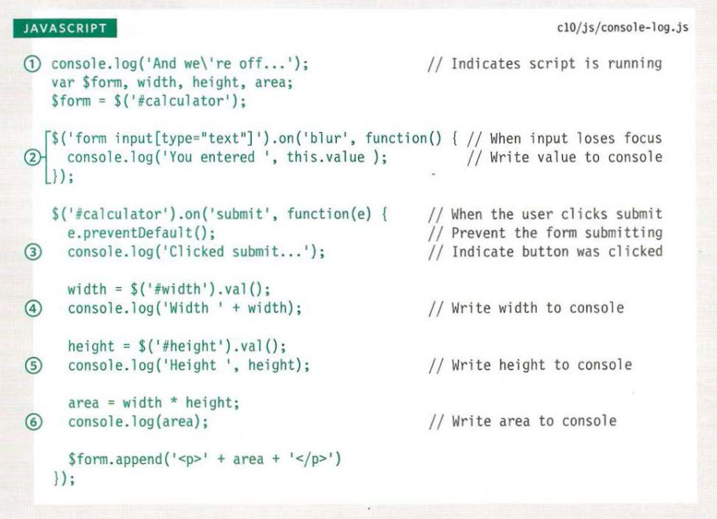

# Read: 10 - JS Debugging
#### 4/4/20
450-486
## Order of Execution
## Execution Context
- Global Context - Code that is in the script but not in a function
- Function Context - Code that is being run within a function
- Eval Context - Text is executed like code in an internal function (no covered)
### Variable Scope
- Global- if a var is declared outside a function can be used anywhere. 
- function level- vars declared within a function can only be used within that function. 
## The Stack
- When a statement needs data from another function, it stacks the new function on top of the current task.
## Execution context & Hoisting
- Each time a script enters a new execution context, there are 2 phases:
1. prepare
    - The new scope is created
    - vars, function and argument are created
    - the value of the `.this` is determined
1. Execute
    - Now it can assign values to vars
    - reference functions and run their code
    - Execute statements
## Understanding Scope
- Lexcial scope.
## Understanding Errors
- If a JS statement generates and error, then it throws and exception.
    - If an error is not handled, the script will just stop processing.
    - need to inform the user when an error occurs.
## Error Objects
- When an error object is created it will contain these properties:
    - `name` - type of execution
    - `message` - description
    - `fileNumber` - Name of the JS file
    - `lineNumber` - Line number of error
- 7 Types of built in error objects
    - `Error` Generic error - the other errors are based on this error
    - `SyntaxError` - Syntax has not been followed
    - `ReferenceError` - Tried to reference a variable that is not declared/within scope
    - `TypeError` - An unexpected data type that cannot be coerced
    - `RangeError` - encodeURI(), decodeURI(), and similar methods used incorrectly.
    - `EvalError` - eval() function used incorrectly.
## Chrome Specific Errors
- `SyntaxError` - `Unexpected EOF`, `Expected token ')'`, `Expected an identifier but found 'name' instead`
- `RefereanceError` - Undeclared Variables, functions undefined
- EvalError
- URIError
- TypeError - incorrect case. DOM node does not exist
- RangeError - cannot create an array with -1 items. Max 20 digits after decimal
- Error - general
- NaN - Not an Error but Not Number
## How to deal with errors
1. Debug the scrip to fix errors
1. handle errors gracefully
    - try, catch, throw, and finally
## Debugging Workflow
- Where is the problem
- What exactly is the problem
## Dev Tools
Duckett pg. 471
## Breakpoints
- Chrome's Dev tools has breakpoints
- Can create a breakpoint by using the `debugger` keyword
## Handling Exceptions
- `try`
    - First try code that might fail.
    - If code fails in here it will be passed to catch.
    - Must have a `catch` or a `finally`
- `catch`
    - if try fails code comes here
- `finally`
    - no matter what run this
## Throwing Errors
- `throw new Error('message');` - string in the `()` will be presented to the user.