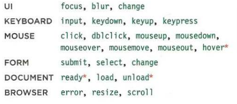

# Read: 02 - jQuery, Events, and The DOM
#### 5/29/20

- Read
    - JavaScript and jQuery book by Jon Duckett (pages 293-301, 306-331 and 354-357)
    - [6 Reasons for Pair Programming](https://www.codefellows.org/blog/6-reasons-for-pair-programming/)
- Skim
    - JavaScript and jQuery book by Jon Duckett pages 332-335
    - JavaScript and jQuery book by Jon Duckett pages 302-305

## 293-301
### What is jQuery?
- A JavaScript library that lets you find elements using CSS-style selectors. 
1. Find elements using jQuery
    - `jQuery()` or `$()`
    - `$('li.hot')` - select a list item with the class hot
1. Do something with the selected elemnt.
    - `$('li.hot').addClass('complete');` - select the list items with the class 'hot' and add a new class called 'complete'.
    - No need to write fallback code.
### Why jQuery?
1. simple selectors
    - Much faster at selecing elemnts
    - can be more accurate
    - Often require less code
1. Common tasks in less code
    - jQuery has methods that offer web developers simpler ways to perform common tasks:
        - loop through elements
        - Add/remove elements from the DOM tree
        - Handle events
        - Fade elements in/out of view
        - Handle Ajax requests
1. Cross-browser compatability
    - Older browsers don't support the lastes methods for selecting elements.

---

<sub>Duckett</sub>
<sub>Duckett</sub>
<sub>Duckett</sub>
<sub>Duckett</sub>

---

## 306-331
### Matched Set/jQuery Selection
- Selected elements are in an array of objects
    - Single elements - array of 1 item
    - multiple elements - array of 'n' items
### Methods that get/set data
- get `.html()`
- set `.html(['thing you want to set'])`
### jQuery Objects store references to elements
- does not create a copy of the element
### Catching jQurey Selectors in a varible
- can create a jQuery variable by using $[variableName]
    - the $ tells the dev that its a jQuery variable
### Looping
- jQuery automaticly loops through all the elements that have been selected. 
    - no need for a `for` or `while` loop.
### Chaining
- you can chain methods together using dotNotation
### Checking a Page is ready to work with
- .ready() checks that the page is ready for your code.
    - `$(document).ready(function(){//code here});`
    - Will fire before all assets are loaded. Can make it look like the page loads faster
- .load() fires on the load event
    - SHould be used when your script relies on assets to have been loaded. 
### Getting element content
- .html()
    - will return the tags and the conent
- .text()
    - will only return the inner text
### Updating Elements
- `.html()` - text and tags
- `.text()` - text
- `.replaceWith()` - replaces all elements with whats in the ()
- `.remove()` - removes all the elements in the selector
### Inserting Elements
1. create the new elements in a jQuery object
    - `let $newDiv = $('<div>');` or `let $newDiv = $('<div>Inner Content</div>');`
1. Use a method to insert the content into the page
    - `.before()` inserts conent before the selected element
    - `.after()` inserts conent after the selected element
    - `.prepend()` inserts content in of selected element infront of all other elements
    - `.append()` inserts content in the selected element behind all other elements.
### Get/Set Attributes
- `.attr()` - used to get/set attributes
    - `.attr('id');` - get the id
    - `.attr('id', 'jon');` - sets the id
- `.removeAttr()` - this will remove the attribute that is in the ()
- `.addClass()` - this adds a class without over writing the class the element already has
- `.removeClass()` - removes the class that is in the ()
### Get/Set CSS Properties
- Get a CSS Property
    - `$('li').css('color');`
- Set a CSS Property
    - `$('li').css('color', 'white');`
    - Setting multiple properties
    ``` JavaScript
    $('li').css({'color', 'white'
    'font-family': 'Courier'
    });
    ```
### Working with Each Element in a selection
- `.each()` allows you to perform statements on each of the elements selected
    - use `$(this)` for the internal selector
``` JavaScript
$('li').each(function(){
    $(this).css('color', 'red');
});
```
### Event Methods
- `.on()` used to handle events. (.on equates to addeventlistener)
    - .`off()` turn off the event listener (equates to removeeventlistener)
<sub>Duckett</sub>
### Event Object
<sub>Duckett</sub>
### Additional Parameters for Event Handlers
- `.on(event[, selector][, data], function(e));`
### Effects
<sub>Duckett</sub>
---
## 354-357
### Loading jQuery from a CDN
- [jQueryCDN](https://code.jquery.com/)
### Where to place the script
- Suggested to place the `<script>` just before the `</body>` tag
### jQuery  Documentation
- [Docs](http://api.jquery.com)

## [Reasons for Pair Programming](https://www.codefellows.org/blog/6-reasons-for-pair-programming/)
- 2 heads are better than one.
### How does it work
- a driver
  - typing, and handling the mechanics of coding
- a navigator
  - uses their words to guide the Driver but doesn't provide direct computer input.
### Why?
- Listening: hearing and interpreting the vocab
- Speaking: using the correct words to communicate an idea
- Reading: understanding what written language intends to convey
- Writing: producing from scratch meaningfullness

1. Greater Efficiency: 2 people working on the same code will catch mistakes in the making. Pair programming can take longer but produces higher-quality code. (less time debugging/troubleshooting).
1. Engaged collaboration: More engaged and more focused. It's harder to procrastinate in a team. Easier to know when to ask for help.
1. Learning from fellow students: Everyone has a different approach to solving problems. It allows students to see how others work and learn from each other.
1. Social Skills: talking is hard. This helps us practice communication.
1. Job interview readiness: if you can talk code with your peer you can talk code with an interviewer. 
1. Work environment readiness: CF grads are a leg up on the CS students since we know how to pair program.