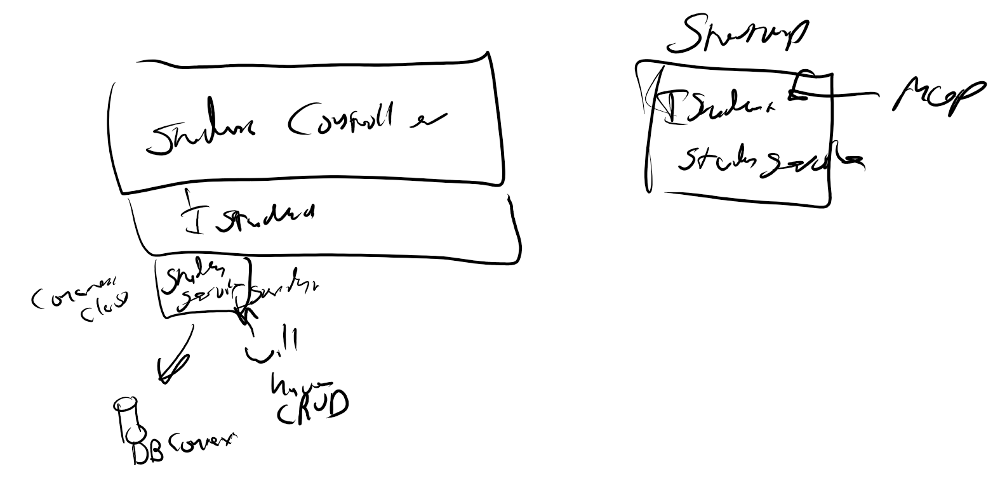

# Day 13

# Migrations
- don't delete the migration

## Controllers
- Repository Design Pattern
- DTOs
- a method in a controller is an action

## Dependancy Injections
- Ability to inject dependancy into our app
    - Keep the app loosely coupled
    - Depend of behavour not of specific
- Repository Design Pattern
    - super flexable



- interfaces showcase behavior

- Disadvanteges
    - Steep learning curve
    - Requires significant overhaul of some exisitng projects
    - Some timelines may not allow for DI.

- SOLID Principles
    - Single responsibility principle
    - Open-Closes Principle
    - Liskov Substitution Principle
    - Interface Segregation Principle
    - Dependency Inversion Principle

- LifeCycle
    - Transient: A new instance will be created each time the object is needed
    - Scoped: A new instance will be created for each web request
    - Singleton: A new instance will be created only once at application startup
    - Instance (special case of singleton): Use AddSingleton() and create an instance yourself
- `services.[LifeCycle]<[Interface], [Object]>()`

- Constructor Injection
- Action Injection


## DI Steps
- Make Interfaces and Services Folders
    - Build out Interfaces and Repos together
- Interface Example:
``` CSharp
public interface IHotel
{
    // contain methods and properties that are required for the classes to implement

    // Create
    Task<Hotel> Create(Hotel hotel);

    // Read
    // Get All
    Task<List<Hotel>> GetHotels();
    // Get individually (by Id)
    Task<Hotel> GetHotel(int id);

    // Update
    Task<Hotel> Update(Hotel hotel);

    // Delete
    Task Delete(int id);

}
```

- In the Repository is where the DbContext injection happens
    - it Happens in the constructor

``` CSharp
private AsyncInnDbContext _context;

public HotelRepository(AsyncInnDbContext context)
{
    _context = context;
}
```

- The Repository implements the interface 
    - `HotelRepository : IHotel`

- Build out the CRUD operations needed on that model

``` CSharp
public async Task<Hotel> Create(Hotel hotel)
{
    _context.Entry(hotel).State = Microsoft.EntityFrameworkCore.EntityState.Added;

    await _context.SaveChangesAsync();

    return hotel;
}

public async Task Delete(int id)
{
    Hotel hotel = await GetHotel(id);
    _context.Entry(hotel).State = Microsoft.EntityFrameworkCore.EntityState.Deleted;
    await _context.SaveChangesAsync();
}

public async Task<Hotel> GetHotel(int id)
{
    Hotel hotel = await _context.Hotels.FindAsync(id);
    return hotel;
}

public async Task<List<Hotel>> GetHotels()
{
    var hotels = await _context.Hotels.ToListAsync();
    return hotels;
}

public async Task<Hotel> Update(Hotel hotel)
{
    _context.Entry(hotel).State = EntityState.Modified;
    await _context.SaveChangesAsync();

    return hotel;
}
```

- Controller Changes -
    - Change the constructor to implement the interface
``` CSharp
private readonly IHotel _hotel;

public HotelsController(IHotel hotel)
{
    _hotel = hotel;
}
```

- In each "action" call the methods from the interface
``` CSharp
// GET: api/Hotels
[HttpGet]
public async Task<ActionResult<IEnumerable<Hotel>>> GetHotels()
{
    List<Hotel> hotels = await _hotel.GetHotels();
    return hotels;
}

// GET: api/Hotels/5
[HttpGet("{id}")]
public async Task<ActionResult<Hotel>> GetHotel(int id)
{
    Hotel hotel = await _hotel.GetHotel(id);
    return hotel;
}

// PUT: api/Hotels/5
[HttpPut("{id}")]
public async Task<IActionResult> PutHotel(int id, Hotel hotel)
{
    if (id != hotel.Id)
    {
        return BadRequest();
    }

    var updatedHotel = await _hotel.Update(hotel);

    return Ok(updatedHotel);
}

// POST: api/Hotels
[HttpPost]
public async Task<ActionResult<Hotel>> PostHotel(Hotel hotel)
{
    await _hotel.Create(hotel);

    return CreatedAtAction("GetHotel", new { id = hotel.Id }, hotel);
}

// DELETE: api/Hotels/5
[HttpDelete("{id}")]
public async Task<ActionResult> DeleteHotel(int id)
{
    await _hotel.Delete(id);

    return NoContent();
}
```

- In setup map the interface to the object
    - `services.AddTransient<IHotel, HotelRepository>();`