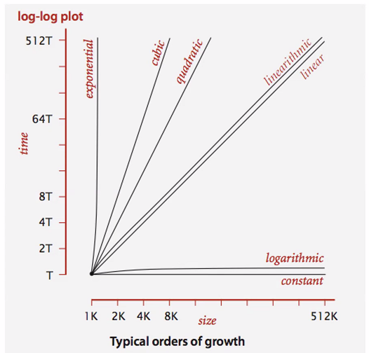

# Day 5

## Career Coaching
### GTM Strategy
- Go-To-Market strategy is a the plan of an organization, utilizing their inside and outside resources, to deliver their unique value proposition to customers and achieve competitive advantage.

### Possible job getting cycle
1. job hunt
1. resume 
1. phone call
1. interview
    - code challenge
        - live share
        - white board
1. meet with the team
    - they want to know who you are
1. the offer

- 7 Steps: Graduation -> Employment
1. Personal Brand
1. Resume
1. Pitch

### Translate your skills
- Ran a daily meeting to review priorities
    - overhauled daily standup meeting in agile work environments for team of 6 employees which boosted productivity 50%
- answer phone in a call center 
    - Performed root-cause analysis of customer issues, averaging 50 solved bugs daily, which a 98% satisfaction rating
- fixed leaky pipes 
    - Relentless troubleshooter for complex network of industrial piping, developed strategy for 22% speed improvement on 80% of jobs
- Created daily schedule for employees
    - achieved a detailed project plan to coordinate collaboration, ultimately resulting in a 35% reduction in overlaps

### Resume
- possible get rid of OS
- maybe get rid of 201 final project
- modern version control system
    - remote version control systems
- update your resume often

# Analysis of Algorithm Efficiency
- Running Time (time efficiency/complexity)
    - Most of our foucs
- Memory Space (space efficiency/ complexity)
    - No longer a huge concern
## Analysis Framework
- measue the input size
- Units for measuring Running Time
- Orders of Growth
- Best/Worst/Average Case Efficiencies

1. Input Size
    - Larger the input(n), the longer the algorithm will run
        - Sorting large arrays
        - multiplying large matricies
    - Input size (n) is the number of elements in the list or total number of elements in all the matricies
    - Input size(n) can sometimes be more than one parameter
    - n is all the inputs added together
    - n is the starting point
    - ask how n can vary
1. Units fo measuring Running Time
    - Focus on an algorithms efficiency
    - Determine times 3 different ways
        - Time in mills
        - Count the number of times each operation is executed
        - **Count the number of times the "basic operation" is executed**
1. Basic operation evaluation   
    - Basic Operation   
        - Operation contributing the most to the total running time
        - Calculate how many times this operation is executed
        - **usually the most time consuming operation in the algo innermost loop**
    - Type of Operation (in order) Look for this!
        1. Division
        1. Multiplication
        1. Addition
        1. Subtraction
        1. Comparison
1. Order of Growth
    - Order of Growth is used to evaluate algo overall efficiency
        - which algo is better and why
    - Easier to see and determine a large values in n (n=input)
    - Algo that require an exponential number of operations are practial for only solving problem of small size
        - (50 or less)

## Worst Case, Best Case, Average Case
- Worst Case (O) - Efficincy for the worst case input of n
    - Runs the longest for all possible inputs of n
    - Backward sorted array
    - Search value doesn't exist or last index
- Best Case (omega) - Efficiency for the best case input of n
    - Runs the quickest for all possible inputs of n
    - Array is already sorted
    - Value is the first index in a search
- Average Case (theta) - Efficiency for a 'typical' or 'random' input of n
    - make assumptions of possible inputs n
    - Probabilities have to be the same
    - **NOT the best and worst case average together**
- Amortized Efficiency - One single operation is expensive but the average is still always better

- `new` used in the algo will cause the space to increase.

## Asymptotic Notations & Basic Efficiency Classes
- 
- 
- 
- loop in a loop if arrays are differnt size then its O(n)
    - if looping over the same array in each loop then its O(n^2)
- sorting algos are
    - O(n) O(nlgn) and O(n2)

- 

# Linked Lists
- while current != null -> current = current.next
- traversal of a linked list 
    - time O(n)
    - space 
        - iterative O(1)
        - recusrive O(logn)

- adding a node
    - add nodes to the beginning
    - 

- for the code challenge
    - make a library for all the data structures

- stringbuilder uses less memory
- concationariton has to double the memory for a moment
